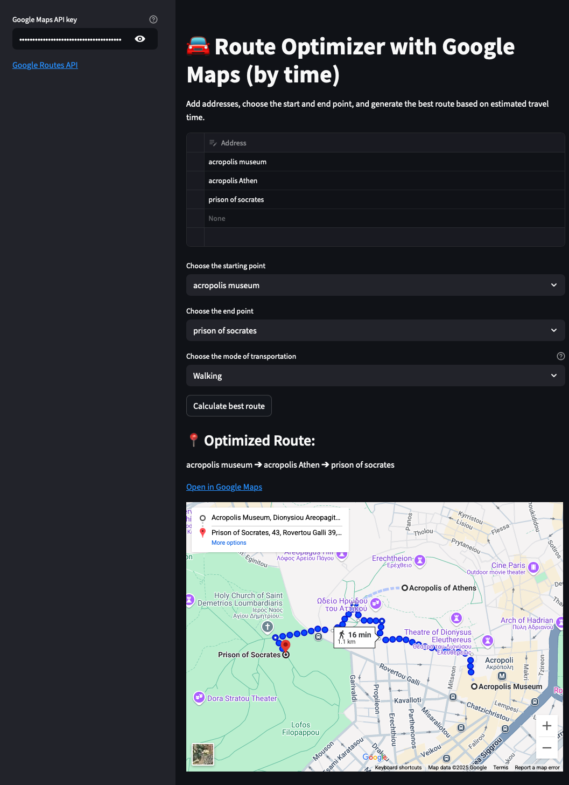

 [](https://streamlit.io/) [](https://developers.google.com/maps/documentation/distance-matrix)

# 🚗 Route Optimizer with Google Maps (by time)

- Find the most time-efficient route between multiple locations using the Google Distance Matrix API and an optimization algorithm.
- Supports driving, walking, biking, and public transport.

App link:
Remove the labels and networks from docker-compose.yml
[http://localhost:8501/](http://localhost:8501/)

> ⚠️ using traefik
> App link: [http://travel.like/](http://travel.like/)

---

## 🖼️ Preview



---

## 🧠 Features

- Add and edit a list of addresses dynamically
- Select start and end points independently
- Choose transportation mode (driving, walking, biking, public transport)
- Optimize route using the **Traveling Salesman Problem** formulation with constraints
- Generate a link to the optimized route directly on **Google Maps**
- Display the route on an embedded map

---

## ⚙️ How to Run

### 1️⃣ Clone the repo

Clone the repo and change branch to home-server

```bash
git clone https://github.com/kelwynOliveira/route-optimizer
git checkout home-server
```

### 2️⃣ Add a .env file

change .env-example to .env

```bash
sudo mv .env-example .env
```

### 3️⃣ Add your Google Routes API key

Inside the `.env` add your API key

```bash
GOOGLE_MAPS_API_KEY=Your_API_here
```

### 4️⃣ Deploy the aplication

```bash
docker-compose up -d --build
```

---

## ✨ How It Works

This app uses the **[Google Routes API](https://developers.google.com/maps/documentation/routes)** to calculate travel times between addresses, then applies a **Linear Programming model** to find the shortest-duration route based on:

- Start and end location
- Selected travel mode (car, walk, bike, public transport)

It supports both **circular (round-trip)** and **open (point-to-point)** route planning.

---

## 📁 Project Structure

```
.
├── app/
.     ├── main.py         # Streamlit app
.     ├── aux.py          # Route calculation and API integration
.     └── requirements.txt
├── .env
├── Dockerfile
└── docker-compose
```

---

## 📌 Notes

- Ensure all addresses are valid and correctly formatted.
- API responses may vary based on limits and usage quota.
